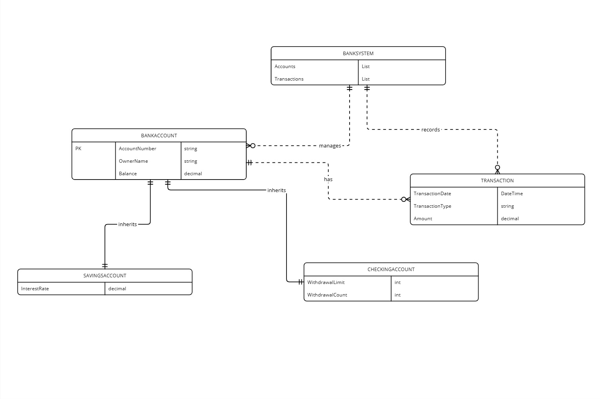

## OOP-Exam-BankSystem
### Diagrami i strukturave te klasave

## Pershkrimi i Projektit   
- Ky projekt eshte nje sistem konsol ne C# per menaxhimin e llogarive bankare, i ndertuar duke perdorur koncepte baze te Programimit te Orientuar ne Objeke (POO).
### Karakteristikat kryesore te ketij Projekti jane:  
 1️⃣Menaxhimi i llogarive bankare,  
 2️⃣Depozitimi dhe terheqja e fondeve,  
 3️⃣Kufizimet specifike per llogarite.

 git clone https://github.com/LeotrimIslami/OOP-Exam-BankSystem.git  
 cd OOP-Exam-BankSystem  
 Press F5 to run with debugging or Ctrl + F5 to run without debugging. The console will open, showing the Task Manager menu.

## Udhezime per Perdorim
1️⃣ Hapni prejektin ne Visual Studio  
2️⃣ Ekzekutoni Programm.cs  
3️⃣ Zgjidhni nje nga opsionet:  
- 1.Create a new Account
- 2.Deposite
- 3.Withdraw
- 4.Show Account details
- 5.Show transaction details
- 6.Exit

## Arkitektura POO
### 1.BankAccount (Klasa Baze)
- Kjo klase perfshine AccountNumber, OwnerName, Balance dhe metodat Deposite dhe Withdraw.
### 2.SavingsAccount (Klasa trasheguese e BankAccount)
- Ne kete klase eshte i perfshire interesi vjetor dhe Kufizimi(nuk lejon terheqje me shume se 50% e bilancit).
### 3.CheckingAccount (Klasa traheguese e BankAccount)
- Ne kete klase eshte i perfshire Kufizimi(lejon maksimumin prej 3 terheqjeve ne dite).
### 4.Transaction (Klasa per transaksione)
- Ne kete klase jane te perfshira Data e Transkaksionit(DATE), Lloji Deposit/Withdraw(TYPE) dhe Shuma e Transaksionit(AMOUNT).

## Zgjedhja e Sfidave
> 1.**Trashegimia (Inheritance)**: *SavingsAccount* dhe *CheckingAccount* jane te trasheguara nga klasa baze *BankAccount*. Kjo e shmang perseritjen e kodit dhe lejone qe funksionaliteti baze te ruhet ne nje vend.  
> 2.**Polimorfizmi (Polymorphism)**: Metoda *Withdraw* eshte e bendosur ne klasat trasheguese *SavingsAccount* dhe *CheckingAccount* per te zbatuar kufimiet specifike per to. *SavingsAccount* kufizon terheqjen ne maskimum prej *50%* te bilancit dhe nuk lejon tejkalimin e gjysmes se bilancit, kurse *CheckingAccount* kufzion terheqje ne *3* here brenda nje dite.

